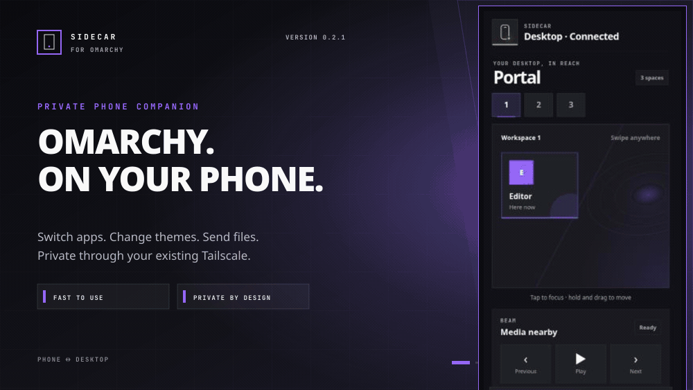

# Sidecar

[](https://plugins.omarchy.org/plugin.html?id=io.github.mtolhuys.sidecar)

> Your Omarchy desktop, comfortably within reach.

Current release: **0.2.1**



Sidecar puts the useful parts of Omarchy on your phone—without exposing a terminal, screen, or filesystem.

- **Portal** — switch workspaces, focus apps, and deliberately move a window.
- **Morph** — preview installed themes, tap to apply, and undo in one touch.
- **Drop** — explicitly send screenshots or small documents to one fixed private inbox.
- **Beam** — use minimal previous, play/pause, and next controls when media is active.

Everything is scoped per phone, approved locally, lock-aware, and carried over your existing Tailscale connection. Sidecar is intentionally not a remote desktop, agent console, terminal, command runner, file browser, or cloud relay.

Drop accepts one to five PNG, JPEG, WebP, GIF, PDF, or UTF-8 text files, up to 25 MiB each and 50 MiB per batch. Files go only to `Downloads/Sidecar`; the phone never chooses or sees a desktop path.

## Trust model

Tailscale supplies private transport. Sidecar's per-phone credential and scopes supply authorization.

Sidecar:

- listens only on `127.0.0.1:47991`;
- uses the user's existing active tailnet identity;
- owns one exact Tailscale Serve route on port `48719`;
- never installs Tailscale, joins a tailnet, changes Tailscale SSH, opens a firewall, or creates a system service;
- requires QR pairing, matching words, and local desktop approval;
- redacts and denies controls whenever the desktop lock state is locked or uncertain.

Read [Security](docs/SECURITY.md) for the full threat model.

## Requirements

- Omarchy with plugin support
- Tailscale installed and already signed in on the desktop
- Tailscale installed and signed in to the same tailnet on the phone
- `qrencode`
- a modern phone browser

Sidecar never installs missing system software. When Tailscale is absent, the desktop panel points directly to Omarchy Install → Service → Tailscale and makes no system change.

## Install

Review the source, then install and enable Sidecar from its public GitHub repository:

```bash
omarchy plugin add https://github.com/mtolhuys/omarchy-sidecar.git --enable
```

During installation, Omarchy asks whether the Sidecar phone icon should appear in the **left**, **center**, or **right** section of the top bar. **Right** is preselected; choose whichever side fits your bar.

Open the phone icon in the Omarchy bar, choose **Pair**, and scan the QR code with the normal phone camera. Keep the Tailscale phone app connected while using Sidecar.

Update an installed copy with:

```bash
omarchy plugin update io.github.mtolhuys.sidecar
```

## Remove

```bash
omarchy plugin remove io.github.mtolhuys.sidecar
```

Removal stops the helper and removes only Sidecar's owned Tailscale Serve route. Received files remain in `Downloads/Sidecar`. The private pairing record is also retained so an ordinary reinstall can recover it; to deliberately forget every Sidecar pairing after removal, delete `${XDG_STATE_HOME:-$HOME/.local/state}/omarchy-sidecar` yourself.

## Local development install or update

Build and install the current artifact:

```bash
cd /path/to/omarchy-sidecar
make local-update
```

The target runs the source tests, builds and verifies the deterministic artifact, and then installs or updates it through Omarchy's plugin commands. It keeps a local Git remote under `${XDG_CACHE_HOME:-$HOME/.cache}/omarchy-sidecar`, so later runs preserve the normal update path and do not remove Sidecar's paired-device state.

Check the installed helper:

```bash
~/.config/omarchy/plugins/io.github.mtolhuys.sidecar/helper/sidecarctl diagnostics |
  jq '{builds,state,routeState,errorCode,securityReceipt}'
```

All three builds should end in `v1012`; `securityReceipt.healthy` should be `true`.

## Development

Desktop integration is tested only in the disposable [Omarchy Plugin Lab](https://github.com/mtolhuys/omarchy-plugin-lab). Start with [CONTRIBUTING.md](CONTRIBUTING.md), [the product contract](docs/PRODUCT.md), and [the test contract](docs/TESTING.md).

## Status

Version 0.2.1 is the current release. Source, browser, fake-adapter HTTP, artifact, security, and disposable-VM evidence are tracked in [RELEASE-EVIDENCE.md](docs/RELEASE-EVIDENCE.md). Physical Android foreground Tailscale use has been user-verified, but the installed-PWA share-target and Drop journey have not yet been observed on a physical phone. iOS support, artifact signing, and mutation/cleanup against an authenticated isolated real Tailscale daemon are not claimed.
